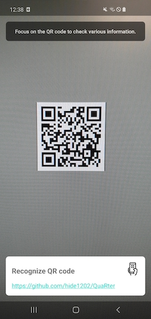

# QuaRter

- Application for reading QR code

## Prerequisites
- Android Studio Arctic Fox | 2020.3.1 Canary 1

## Core libraries
- [CameraX](https://developer.android.com/training/camerax) for using the camera of a device
- [zxing](https://github.com/zxing/zxing) for reading QR code

## Screenshot
